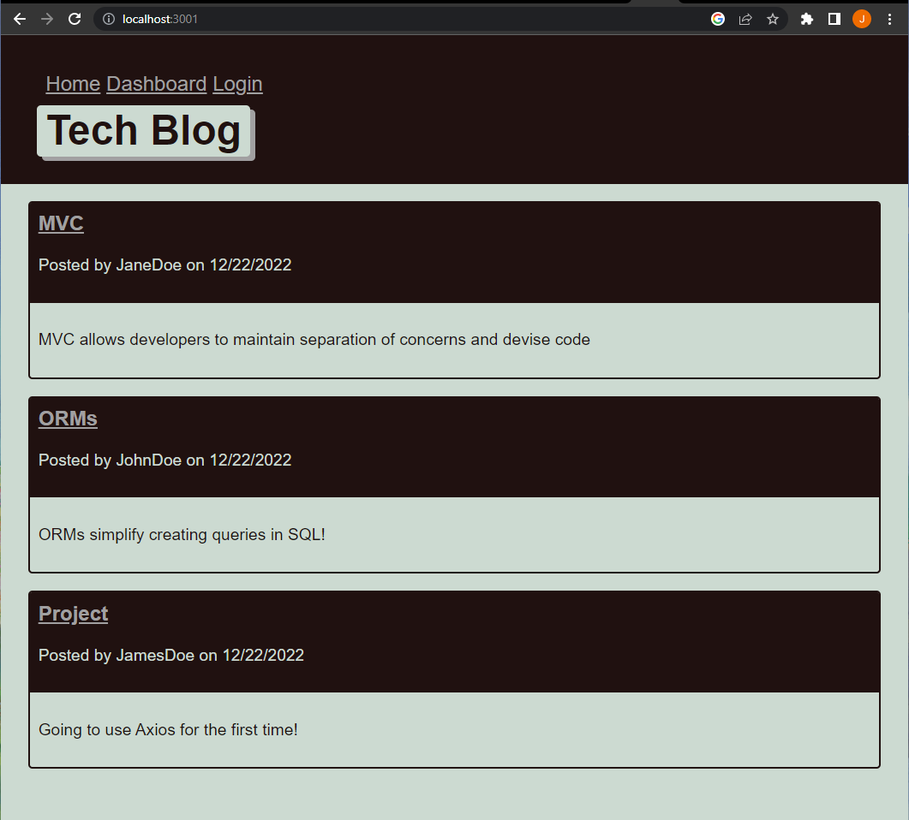

# Module 13 E-Commerce Back End

## Table of Contents
1. [Description](#description)
2. [Installation](#installation)
3. [Testing](#testing)
4. [Contribution](#contribution)
5. [Mock-Up](#mock-Up)
6. [Application](#application)
7. [License](#license)
8. [Contact](#contact)

## Description
This project is designed to let a user sign up, log in, and log out of a profile created on a tech blog. The user can add posts and comment on other user's posts as well. This app utilizes mySQL, sequelize, express, handlebars, and the use of helpers.

## Installation
Install dependencies using ``` npm i ``` and make sure to enter in user credentials in the  ``` .env ``` file. Source and seed the database by running the ``` schema.sql ``` file and ``` seeds/index.js ```. Finally, run ``` npm start ``` to begin the server.

## Testing
No tests written for this project!

## Contribution
Currently not accepting contributions to the repo.

## Demo Video

## Mock-Up
()

## License
Please see https://mit-license.org/ to get info about this license


## Contact
Email: jasadowski7@gmail.com
GitHub: https://www.github.com/jsadowski7